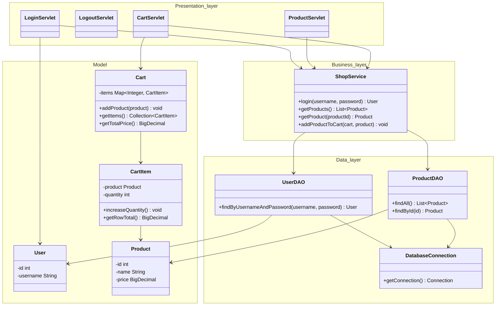

# Klassdiagram

## Lager

Presentation layer består av JSP-filer och servlets. Det lagret tar emot HTTP requests, använder `HttpSession` och skickar data till JSP.

Business layer består av `ShopService`. Det lagret innehåller enkel applikationslogik för login, produktlista och kundvagn.

Data layer består av `UserDAO`, `ProductDAO` och `DatabaseConnection`. Det lagret använder JDBC och PostgreSQL.
